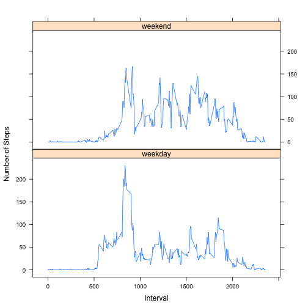

# Reproducible Research: Peer Assessment 1

## Loading and preprocessing the data

```r
data_all<-read.csv(unzip("activity.zip","activity.csv"))
data<-data_all[!is.na(data_all$steps),]
data$date <- as.Date(data$date)
```

## What is mean total number of steps taken per day?

```r
totalSteps <- tapply(data$steps,data$date,sum)
totalStepSummary <- summary(totalSteps)
hist(totalSteps,main="Histogram of Total Number of Steps per Day (ignoring NA)",xlab="Total number of Steps",breaks=20)
abline(v=totalStepSummary["Median"])
abline(v=totalStepSummary["Mean"])
```

 

```r
totalStepSummary
```

```
##    Min. 1st Qu.  Median    Mean 3rd Qu.    Max. 
##      41    8841   10765   10766   13294   21194
```

The mean is 10766 and the median is 10765, they are displayed in the plot with vertical lines.

## What is the average daily activity pattern?

```r
averagePerInterval <- tapply(data$steps,data$interval,mean)
plot(names(averagePerInterval),averagePerInterval,type="l",)
max_ave <- names(averagePerInterval[averagePerInterval==max(averagePerInterval)])
abline(v=max_ave)
```

 

The index of the max ave is 835.

## Imputing missing values
There are 2304 missing values. To fill in these missing values we will calculate the average steps per interval and replace the NAs with the average value for it's interval.

```r
#lookup the average for each interval and insert it into a column in the data frame
data_all$averagePerInterval <- averagePerInterval[as.character(data_all$interval)]

#assign the average to the NAs in the steps column
data_all$steps <- ifelse(is.na(data_all$steps),data_all$averagePerInterval,data_all$steps)

#add up all the steps for each day
totalStepsAll<-tapply(data_all$steps,data_all$date,sum)

#generate histogram
hist(totalStepsAll,main="Histogram of Total Number of Steps per Day (Imputing NA)",xlab="Total number of Steps",breaks=20)
totalStepsAllSummary<-summary(totalStepsAll)

#add some vertical lines
abline(v=totalStepsAllSummary["Median"])
abline(v=totalStepsAllSummary["Mean"])
```

 

```r
totalStepsAllSummary
```

```
##    Min. 1st Qu.  Median    Mean 3rd Qu.    Max. 
##      41    9819   10766   10766   12811   21194
```

The mean is 10766 and the median is 10766, they are displayed in the plot with vertical lines. Since we are just adding more days with average results we make the histogram more peaked at the mean.


## Are there differences in activity patterns between weekdays and weekends?

```r
#create the weekend and weekday types
data_all$dayType <- ifelse(weekdays(as.Date(data_all$date)) %in% c("Saturday","Sunday"),"weekend","weekday")

#subset intervals by day type
weekendDays <- subset(data_all,subset=dayType=="weekend")
weekdayDays <- subset(data_all,subset=dayType=="weekday")

#take the mean of the steps over the intervals
aveWeekend <- with(weekendDays,tapply(steps,interval,mean))
aveWeekday <- with(weekdayDays,tapply(steps,interval,mean))

#build a data frame for each day type with the averages, want to set stringAsFactors false so we can turn the intervals into integers easily later  
weekdayDF<-data.frame(Interval=names(aveWeekday),Steps=aveWeekday,dayType="weekday",stringsAsFactors=F)
weekendDF<-data.frame(Interval=names(aveWeekend),Steps=aveWeekend,dayType="weekend",stringsAsFactors=F)

#concatenate the two data frames
allDF <-rbind(weekdayDF,weekendDF)

#do this so the x axis of the plot works right
allDF$Interval<-as.numeric(allDF$Interval)

#sort by the Interval
allDF<-allDF[order(allDF$Interval),]
library(lattice)
with(allDF,xyplot(Steps~Interval|dayType,type="l",layout=c(1,2),ylab="Number of Steps"))
```

 

```r
weekendWeekdayPercentDiff<-(sum(aveWeekend)-sum(aveWeekday))/sum(aveWeekday)*100
```


Interesting differences between the work week activity and the weekend is that clearly thing get started later on the weekend. The steps increase sharply after 500 on the weekday where as on the weekend there's only a small peak at this point in the day. The smaller peak is very similiarly shaped, perhaps occational having to go into the office on the weekend? Having said that it does appear that once we get going there is a lot more walking done on the weekend than during the day. Summing up the average number of steps on the weekend vs weekday shows an increase of 18.97%. This would make sense as personal errands might involve more travel than a typical work day.
